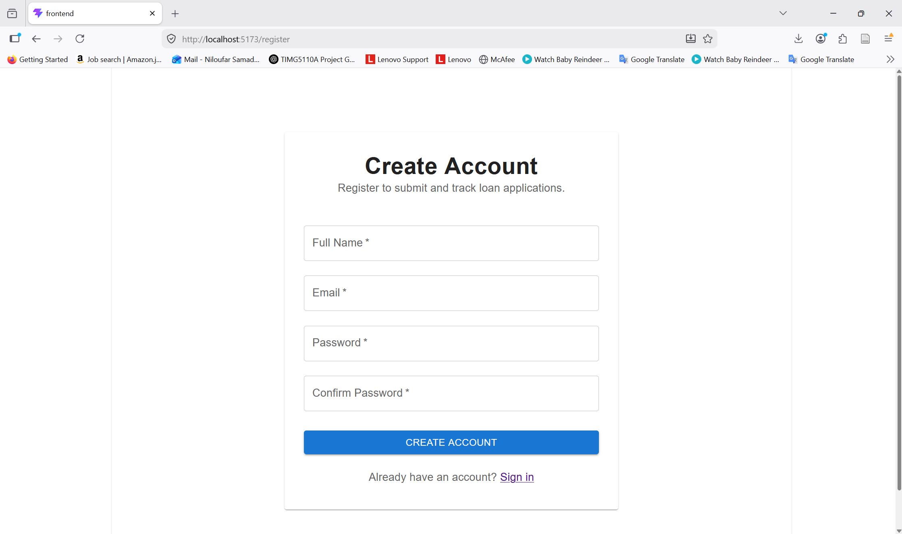
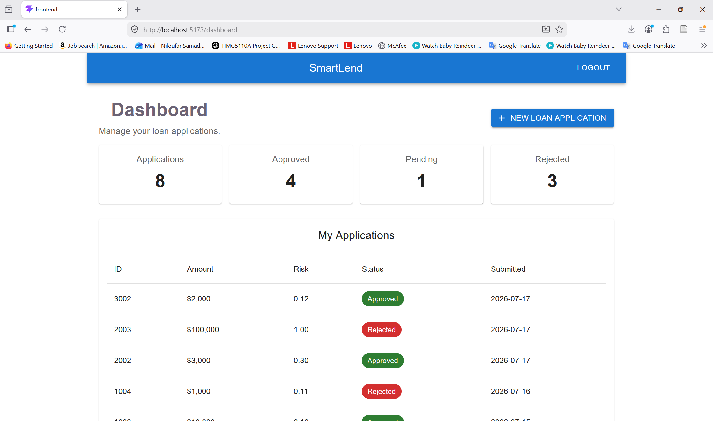
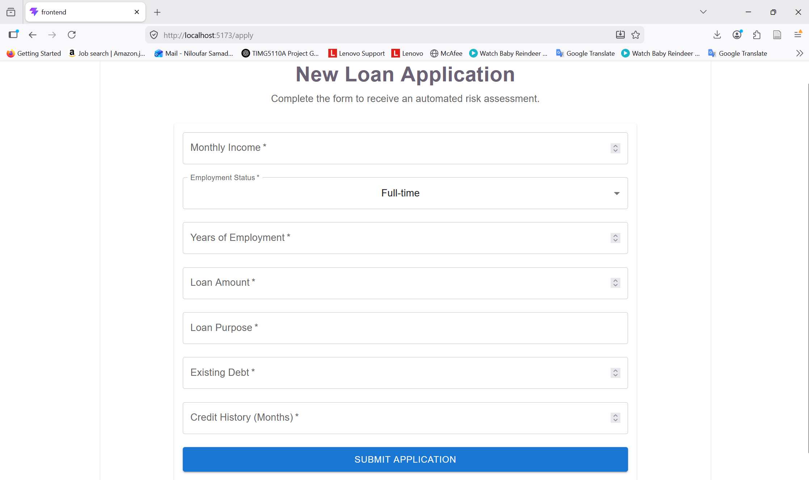
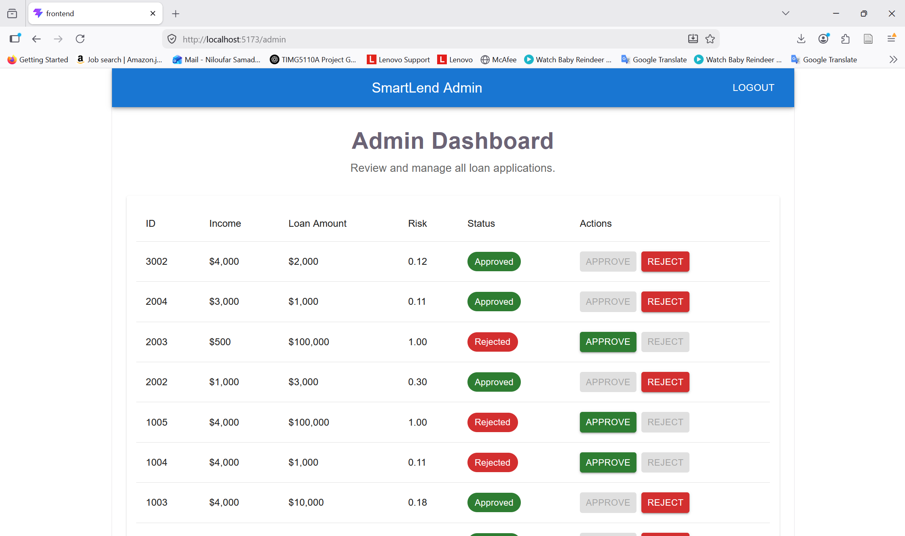

# SmartLend

SmartLend is a full-stack loan application and risk assessment platform that combines a modern web application with a machine learning scoring service.

Users can register, submit loan applications, view their application history, and track decisions. Administrators can review applications and approve or reject them through a dedicated dashboard.

## Screenshots

### Login


### Registration


### User Dashboard


### Loan Application


### Admin Dashboard


## Features

### Customer

- User registration and secure login
- JWT-based authentication
- Submit loan applications
- Automatic loan risk assessment
- View submitted applications
- Track application status

### Administrator

- Role-based authorization
- Review all loan applications
- View risk scores and applicant information
- Approve or reject applications
- Monitor application statistics

## Tech Stack

### Backend

- C#
- ASP.NET Core Web API
- Entity Framework Core
- SQL Server
- JWT Authentication
- BCrypt password hashing

### Frontend

- React
- TypeScript
- Material UI
- Axios
- Vite

### Machine Learning Service

- Python
- FastAPI
- Scikit-learn
- Pydantic

### DevOps

- Docker
- Docker Compose
- Nginx
- Git and GitHub

## Architecture

SmartLend consists of four containerized services:

1. **Frontend** — React application served through Nginx
2. **API** — ASP.NET Core Web API
3. **ML Service** — FastAPI risk-scoring service
4. **Database** — SQL Server

```text
User
  |
  v
React Frontend
  |
  v
Nginx Reverse Proxy
  |
  v
ASP.NET Core API
  |             |
  v             v
SQL Server   FastAPI ML Service